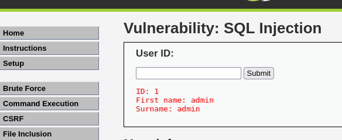
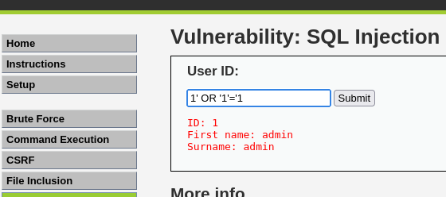
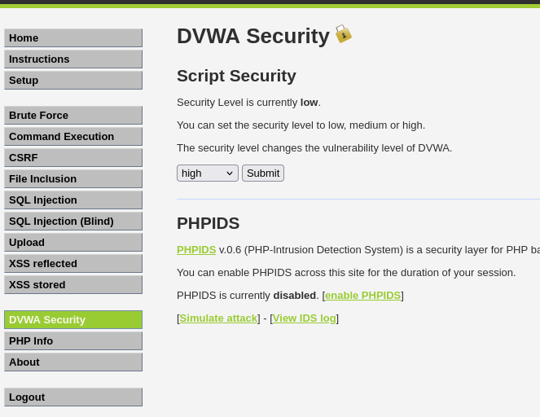
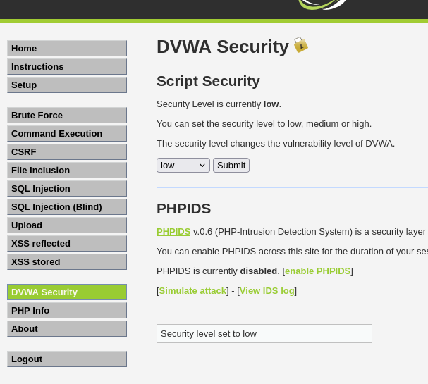

# SQL Injection Attack on DVWA (Web Exploitation Lab)

## 🧠 Overview
This project provides a detailed analysis of SQL injection vulnerabilities 
in a web application (DVWA), demonstrating how improper input handling 
can lead to unauthorized data access.

The focus is on understanding how web application logic is bypassed, 
how different security levels affect exploitation, 
and how such vulnerabilities can be mitigated.

---

## ⚙️ Lab Environment

- Attacker: Kali Linux
- Target: Metasploitable (DVWA)
- Platform: VirtualBox
- Application: DVWA (Damn Vulnerable Web App)

---

## 🔎 Reconnaissance

The target application was accessed via a local lab environment:

http://192.168.56.103 (DVWA hosted on Metasploitable VM)

DVWA was located and accessed through the web interface.
This step helped identify a web-based attack surface for further testing.
---

## 🧪 Initial Testing (Normal Input)

A normal query was tested:

```bash
User ID: 1
```


### Exploitation Technique
This payload manipulates the SQL query by injecting a condition that always evaluates to true, causing the database to return all user records instead of a single result..



### Exploitation Outcome

The injected payload altered the SQL query logic, allowing unauthorized retrieval of multiple user records.

This demonstrates how input manipulation can break authentication logic and expose sensitive data.

## Security Insight

This vulnerability highlights critical weaknesses in web application design:

- Lack of input validation allows malicious payload injection
- Absence of parameterised queries enables direct query manipulation
- Poor error handling can expose backend logic

These weaknesses allow attackers to bypass authentication mechanisms 
and gain access to sensitive data without valid credentials.

Mitigation requires implementing secure coding practices such as:
- Prepared statements (parameterised queries)
- Strict input sanitisation
- Proper error handling and logging

## 🔒 Security Level Observation

The SQL injection only worked when DVWA security level was set to LOW.

When set to HIGH, the application prevented the attack through input validation, demonstrating how proper security controls mitigate injection vulnerabilities.
### High Security



### Low Security



## Key Difference from SOC Simulation

While the SOC project focuses on detecting and responding to attacks at the network and system level, 
this project focuses on how vulnerabilities originate within web applications.

This demonstrates both:
- How attacks are performed (offensive view)
- Why vulnerabilities exist in application logic (development view)

Together, these projects demonstrate a broader and more practical understanding of cybersecurity, 
covering both application-level vulnerabilities and real-world detection and response.


## Conclusion

This project demonstrated how improper input validation in web applications 
can lead to SQL injection vulnerabilities, allowing attackers to retrieve 
unauthorized data.

By analysing both exploitation techniques and security controls, this project 
highlights the importance of secure coding practices in preventing web-based attacks.

Combined with the SOC Simulation project, this work demonstrates a broader 
understanding of cybersecurity across both application-level vulnerabilities 
and real-world attack detection and response.

For a broader view of how attacks are detected and handled in real environments, 
see my SOC Simulation project.
