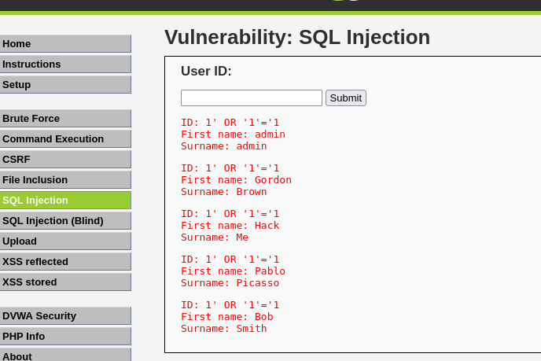

# SQL Injection Attack on DVWA (Web Exploitation Lab)

## 🧠 Overview
This project provides a detailed analysis of SQL injection vulnerabilities 
in a web application (DVWA), demonstrating how improper input handling 
can lead to unauthorized data access.

The focus is on understanding how web application logic is bypassed, 
how different security levels affect exploitation, 
and how such vulnerabilities can be mitigated.
---

## ⚙️ Lab Environment

- Attacker: Kali Linux
- Target: Metasploitable (DVWA)
- Platform: VirtualBox
- Application: DVWA (Damn Vulnerable Web App)

---

## 🔎 Reconnaissance

The target application was accessed via browser:

http://192.168.56.103

DVWA was located and accessed through the web interface.
This step helped identify a web-based attack surface for further testing.
---

## 🧪 Initial Testing (Normal Input)

A normal query was tested:

```bash
User ID: 1
```


### Injection Attempt
This payload manipulates the SQL query by injecting a condition that always evaluates to true, causing the database to return all user records instead of a single result..


## 🚨 Attack Result
The injection successfully returned multiple user records, demonstrating that input validation was not properly implemented.



## 🔒 Security Level Observation

The SQL injection only worked when DVWA security level was set to LOW.

When set to HIGH, the application prevented the attack through input validation, demonstrating how proper security controls mitigate injection vulnerabilities.
### High Security


### Low Security


## 📌 Conclusion

This project demonstrated how improper input validation in web applications can lead to SQL injection vulnerabilities, allowing attackers to retrieve unauthorized data.
``
